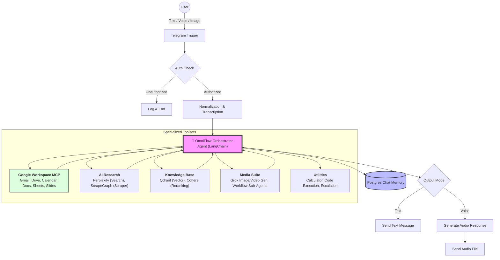

# 🤖 OmniFlow AI: The Ultimate n8n Automation Agent

**OmniFlow AI** is a high-performance, multi-modal automation agent built on n8n. It simulates an "OpenClaw" multi-agent architecture, transforming your Telegram into a sophisticated command center. It doesn't just "run" workflows—it **reasons, plans, and executes** complex tasks across your entire digital workspace.

---

## 🧠 Sophisticated Orchestration Logic

Unlike simple linear bots, OmniFlow AI follows a dynamic **Circular Execution Flow**:

1.  **Analyze**: Understands user intent and identifies all sub-tasks (Text, Voice, or Image).
2.  **Plan**: Maps each sub-task to the most suitable tool or sub-agent.
3.  **Execute**: Calls tools sequentially or in parallel (e.g., Research → Create Doc → Email).
4.  **Evaluate**: Validates tool outputs and determines if further action is needed.
5.  **Synthesize**: Compiles all findings into a clear, human-readable response.

---

## 🚀 Detailed Features

### 🎙️ Multi-modal Command Center
- **Smart Voice Processing**: Integrated **OpenAI Whisper** transcription allows you to send long voice notes which the agent summarizes and acts upon.
- **Vision & OCR**: Powerful image handling. Send screenshots of documents or photos; the agent uses OCR and Vision models to "read" and process them.
- **Security Protocols**: Built-in User ID verification ensures only you can access the powerful tools and sensitive data.

### 💼 Google Workspace Deep-Sync (via MCP)
The agent uses the **Model Context Protocol (MCP)** to act as your virtual office manager:
- **📧 Gmail**: Full CRUD (Create, Read, Update, Delete) capability. It can draft professional replies based on your conversation history.
- **📅 Calendar**: Real-time availability checking and conflict-aware scheduling.
- **📁 Drive & Docs**: Not just uploading files, but searching across your entire Drive to find specific information to include in a generated Doc or Sheet.
- **📊 Sheets & Slides**: Automation of data entry and slide creation for reports or presentations.

### 🔍 Research & Intelligence Suite
- **Web Research**: Uses **Perplexity AI** for deep, cited search results and **ScrapeGraphAI** for precision data extraction from complex websites.
- **Knowledge Base (RAG)**: Connects to **Qdrant** (Vector Store) and **Cohere** (Reranker) to provide answers based on your private document library.
- **Media Creative**: Specialized sub-workflows for generating and editing high-quality Images and Videos using **Grok** and **Telegram** as the interface.

---

## 🏗️ Technical Architecture

---

## 🛠️ Configuration & Environment

### Required API Credentials
| Service | Purpose |
| :--- | :--- |
| **Telegram** | Bot Token and User ID (Authorization) |
| **OpenAI** | Whisper (Speech-to-Text) and GPT-4o (Vision) |
| **Google Gemini** | Core Reasoning LLM |
| **Perplexity** | High-accuracy Web Research |
| **Qdrant** | Vector Database for RAG |
| **Google Cloud** | OAuth Credentials for G-Suite Services |

### Advanced Setup (n8n)
1.  **Import**: Import `OmniFlow_AI.json` into n8n.
2.  **Credentials**: Set up `Chat Google Gemini`, `Telegram`, and `OpenAI` credentials.
3.  **MCP Endpoints**: Configure the `mcpClientTool` nodes with your specific MCP server URLs (e.g., Gmail/Drive connectors).
4.  **Sticky Notes**: Look for the internal documentation notes within the n8n canvas for specific node-level instructions.

---

## 🚨 Troubleshooting

- **Auth Issues**: Ensure your Telegram User ID is correctly set in the `Normalization` or `Auth` nodes.
- **MCP Connection**: Verify that your MCP server endpoints are reachable by n8n.
- **Audio/Image**: Ensure n8n has the necessary permissions to handle binary data.

---

## 📜 Credits & License
- **Core Design**: Inspired by the OpenClaw Multi-Agent Architecture.
- **Built with**: n8n, LangChain, and Telegram.
- **License**: MIT

---
*Developed with ❤️ by Antigravity*
